# Pico Micro-Shogi (3x4 Chess)

A fully-featured, miniaturized Shogi/Chess variant for the RP2040 (Raspberry Pi Pico). Played on a 3x4 grid, this game features capture-and-drop mechanics, piece promotion, AI opponents, and an auto-save system—all controlled using just the Pico's built-in `BOOTSEL` button and a 128x64 OLED display.

<table align="center">
  <tr>
    <td align="center">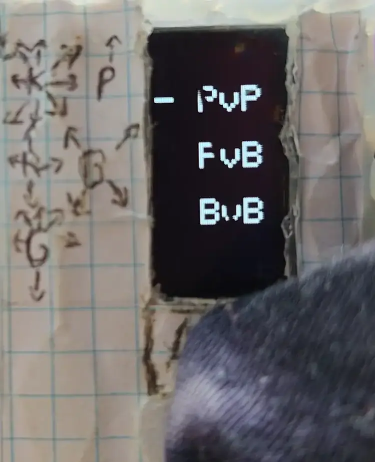 <b>Boot & menu scan</b></td>
    <td align="center"> <b>Bot vs Bot gameplay</b></td>
  </tr>
</table>

## Features

* **3 Game Modes:** Player vs Player (PvP), Player vs Bot (PvB), and Bot vs Bot (BvB).
* **Capture & Drop:** Captured enemy pieces are added to your inventory and can be dropped on empty squares as your turn.
* **Piece Promotion:** Pawns that reach the furthest rank automatically promote to Gold.
* **Auto-Save & Resume:** Game states are automatically saved to flash memory via LittleFS. If you unplug the Pico or reset it, you can resume exactly where you left off.
* **Single-Button Interface:** The game uses an auto-scanning cursor. Simply press the RP2040's native `BOOTSEL` button to make selections.
* **OLED Graphics & Animations:** Custom piece animations for moving and dropping, alongside score tracking.

## Hardware Requirements

* **Microcontroller:** Raspberry Pi Pico (or any RP2040-based board).
* **Display:** 128x64 I2C OLED Display (SSD1306).
* **Wiring:**
    * **SDA:** GPIO 28
    * **SCL:** GPIO 29
    * **VCC:** 3.3V
    * **GND:** GND
    * *No external buttons are required! Input is handled via the on-board `BOOTSEL` button.*

### Build / Wiring Diagram

<table align="center">
  <tr>
    <td align="center"> <b>How the device is wired and assembled</b></td>
  </tr>
</table>

## Software Dependencies

This project is built using the Arduino IDE with the **Earle F. Philhower RP2040 core**. Ensure you have the following libraries installed via the Arduino Library Manager:

* `Adafruit GFX Library`
* `Adafruit SSD1306`
* `Wire` (Standard I2C library)
* `LittleFS` (Included in the RP2040 core)

## How to Play

### Controls
The game uses a timed auto-scan mechanism for input.
* **Select/Confirm:** Wait for the cursor (`X` or `^`) to hover over the piece or tile you want to interact with, then **press and hold the `BOOTSEL` button** until the selection registers.
* **Turn Flow:** Select the piece you want to move (or a piece in your inventory), then select the valid destination tile.

<table align="center">
  <tr>
    <td align="center">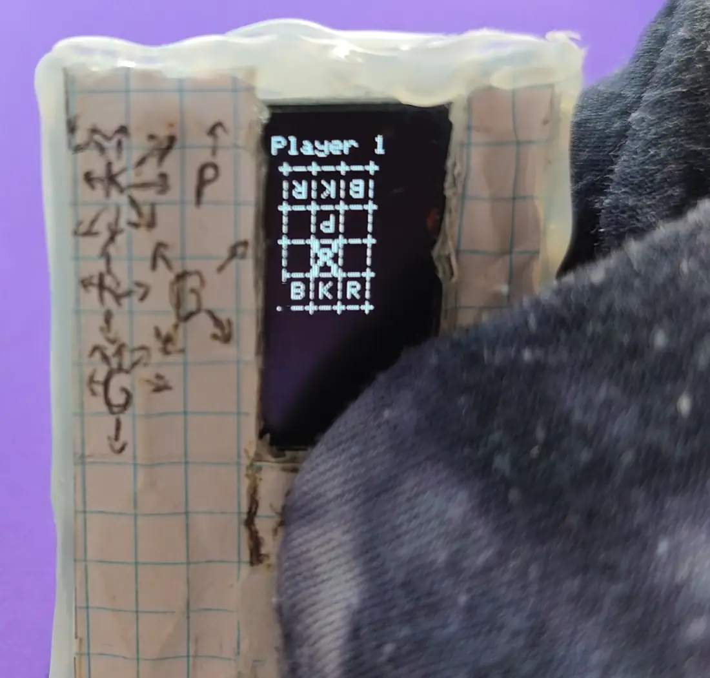 <b>Cursor auto-scan</b></td>
    <td align="center">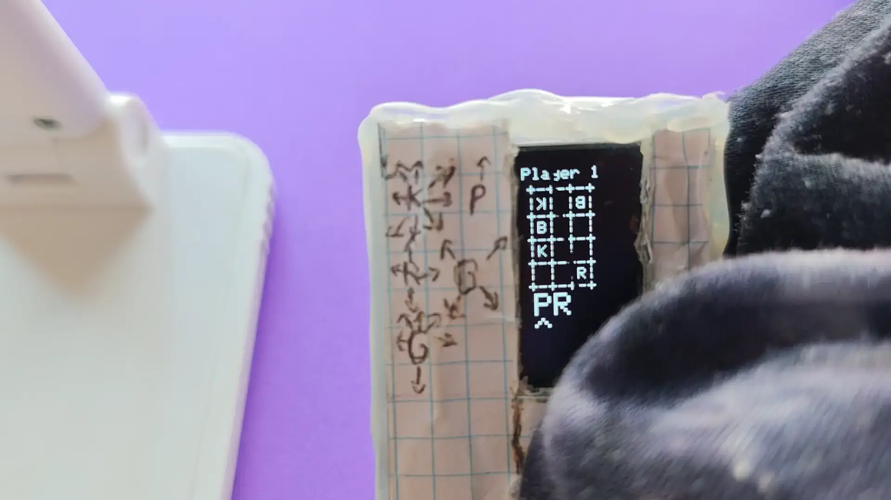 <b>Inventory cursor</b></td>
    <td align="center">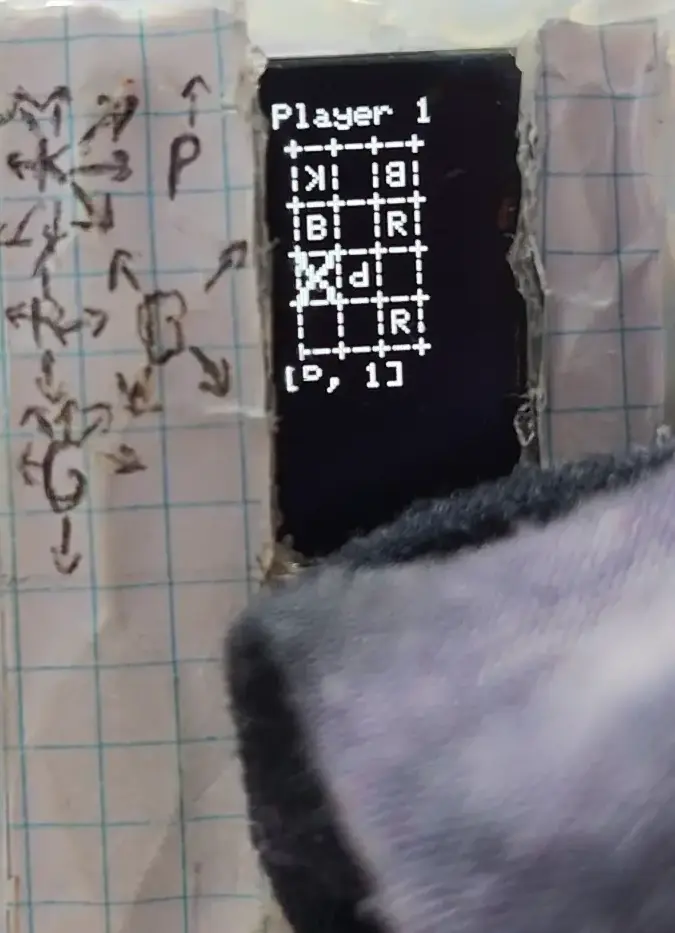 <b>Two-step selection</b></td>
  </tr>
</table>

### The Pieces
The board is a 3x4 grid. Pieces are represented by the following characters:
* **K (King):** Moves 1 square in any direction. If your King is captured, you lose. If your King safely reaches the opposite end of the board, you win!
* **R (Rock/Rook):** Moves 1 square vertically or horizontally.
* **B (Bishop):** Moves 1 square diagonally.
* **P (Pawn):** Moves 1 square straight forward.
* **G (Gold):** A promoted Pawn. Moves 1 square in any direction *except* diagonally backwards.

> **Note:** On this compact 3x4 board every piece moves a single square per turn (the engine restricts all moves to a 1-cell radius). The Rook and Bishop keep their *direction* rules (orthogonal / diagonal) but not the unlimited range of standard chess/shogi.

<table align="center">
  <tr>
    <td align="center">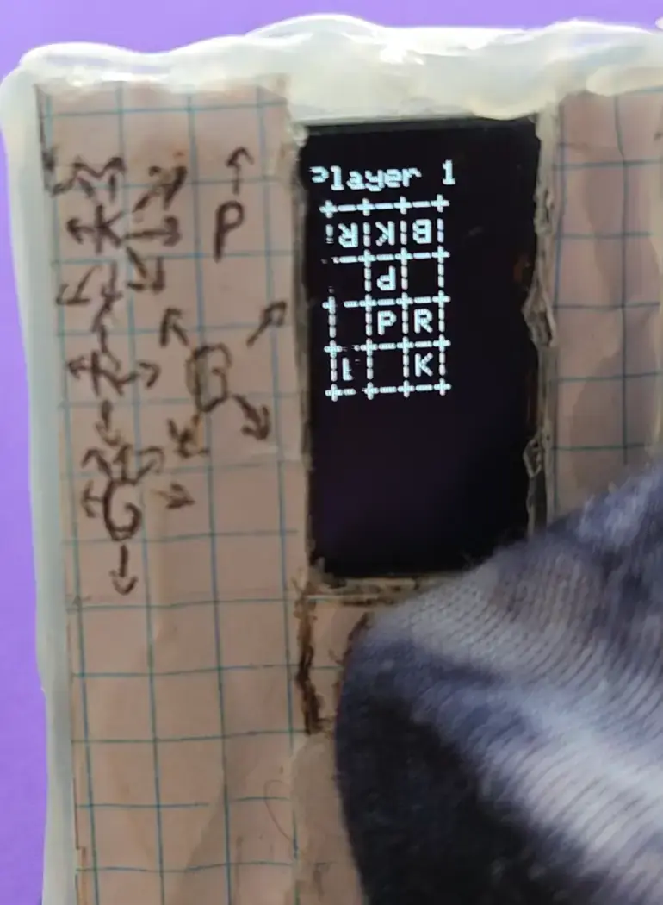 <b>Move animation</b></td>
  </tr>
</table>

### Mechanics
1.  **Capturing:** Moving onto an opponent's piece captures it. It is placed in your inventory (displayed at the bottom of the screen).
2.  **Dropping:** Instead of moving a piece on the board, you can "drop" a captured piece from your inventory onto any empty square.
3.  **Promotion:** If a Pawn (P) reaches the opponent's starting row, it automatically promotes to a Gold (G) piece. Captured promoted pieces revert back to their base state in your inventory.

<table align="center">
  <tr>
    <td align="center">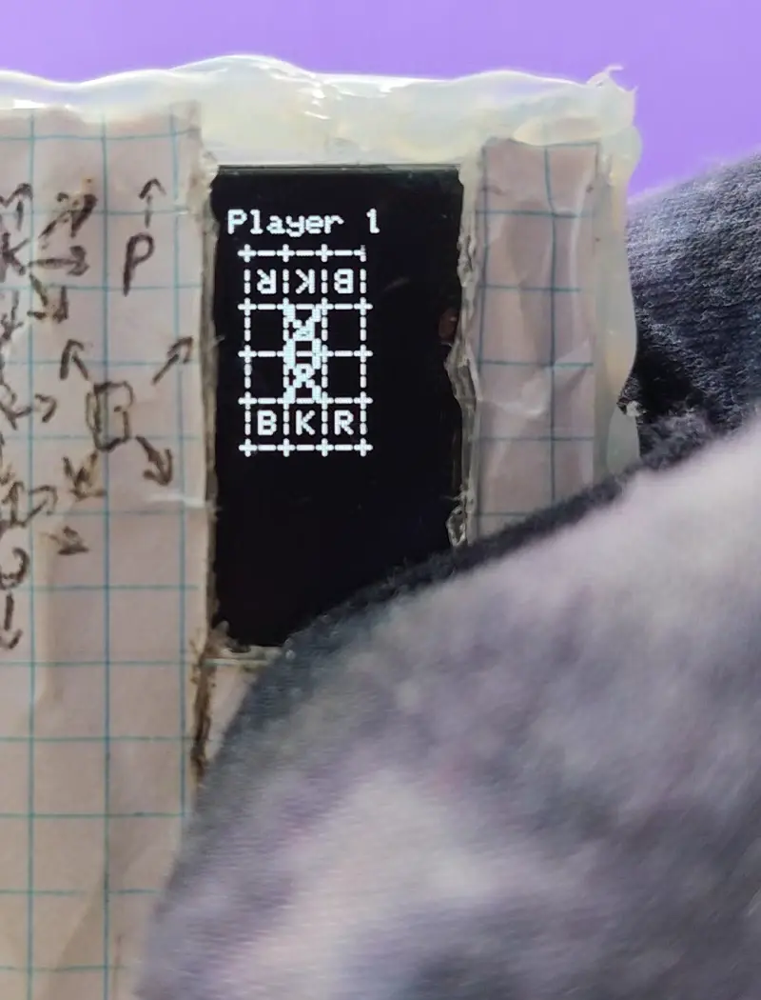 <b>Capturing a piece</b></td>
    <td align="center">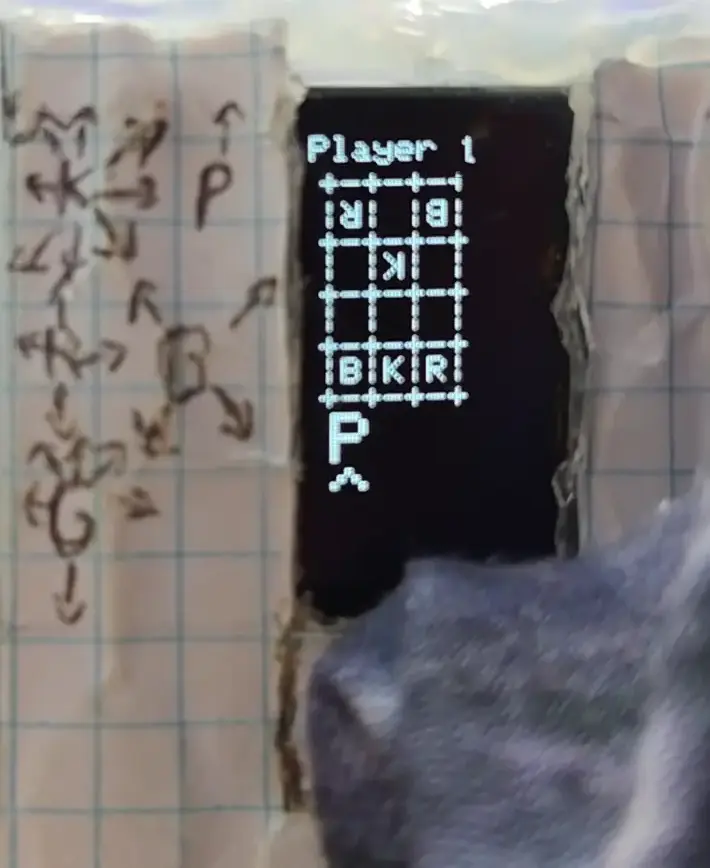 <b>Dropping from inventory</b></td>
    <td align="center">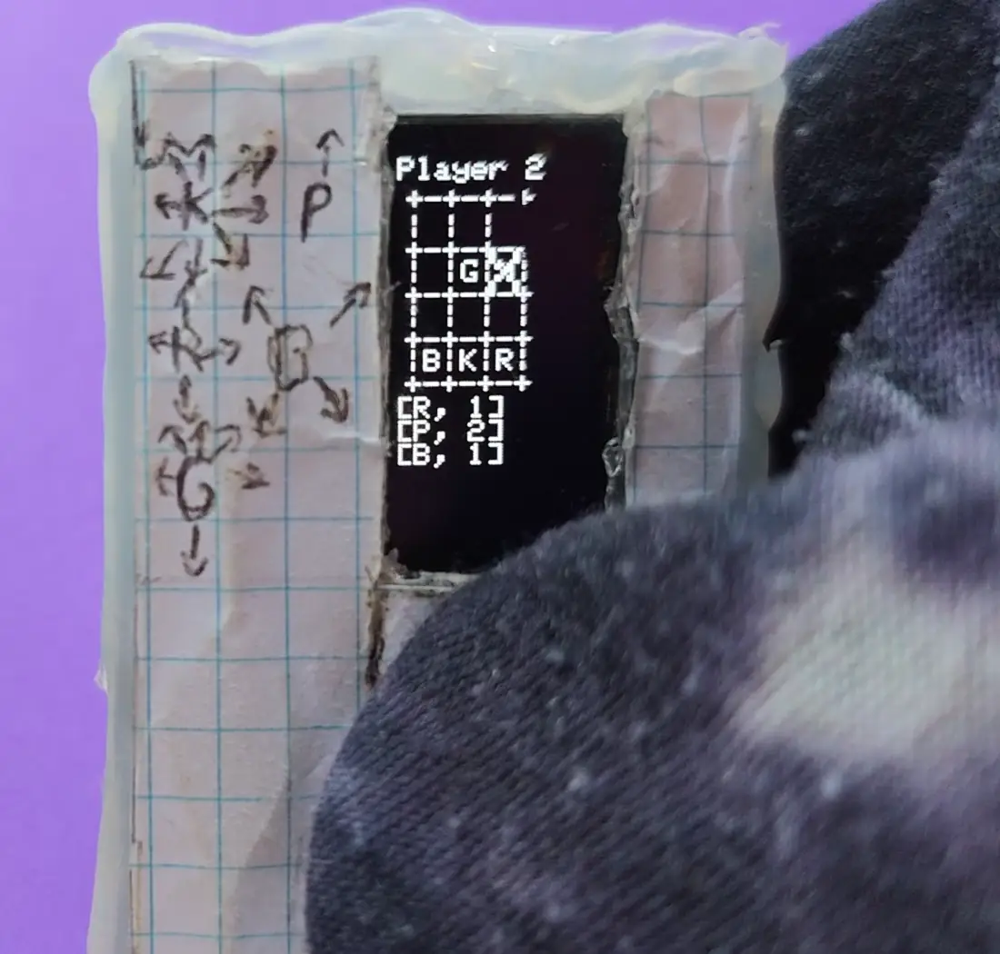 <b>Promoted piece reverts</b></td>
    <td align="center">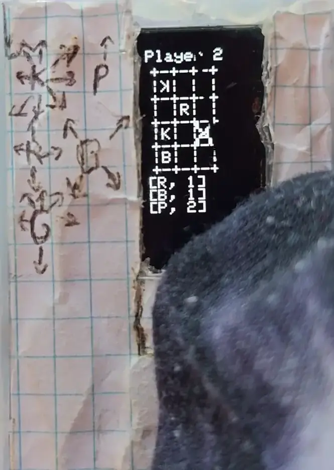 <b>Pawn promotes to Gold</b></td>
  </tr>
</table>

### Winning, Losing & Draws
* **Win by King's march:** get your King safely to the far end of the board.
* **Win by capture:** take the opponent's King.
* **Draw:** a player with no legal moves who is *not* in check results in a draw (`=`).

<table align="center">
  <tr>
    <td align="center">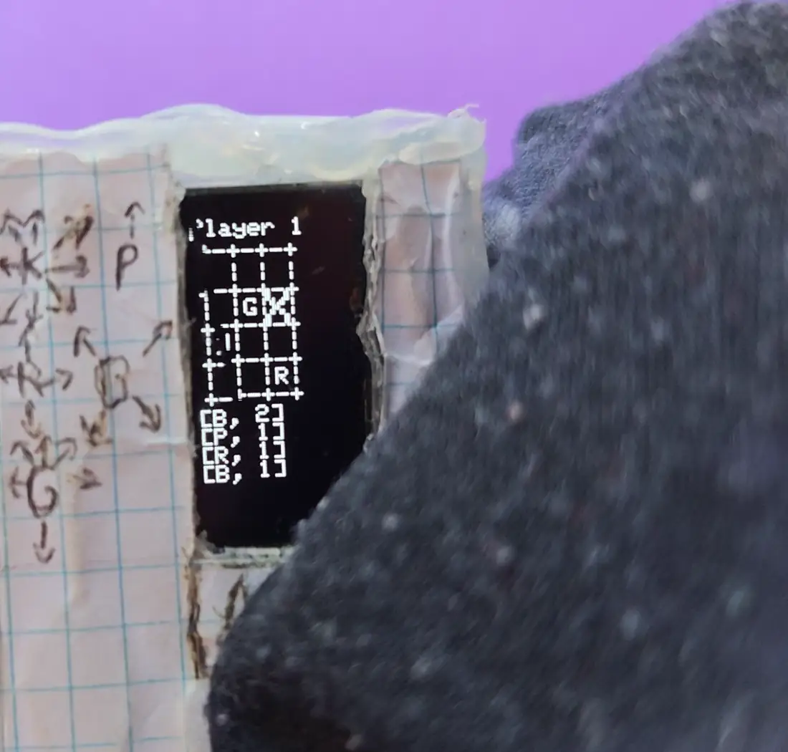 <b>King reaches the end (win)</b></td>
    <td align="center">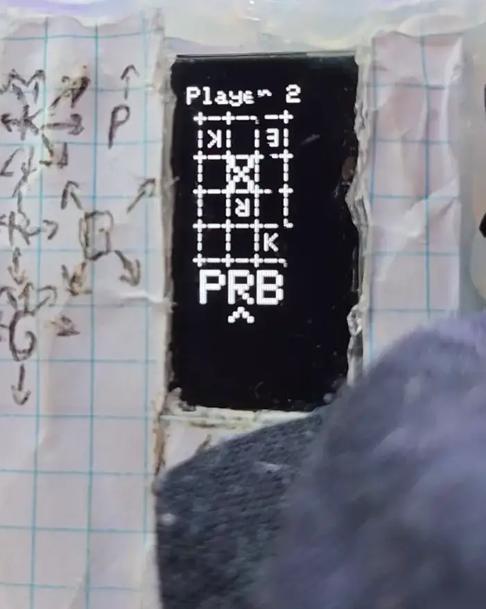 <b>King captured (loss)</b></td>
    <td align="center">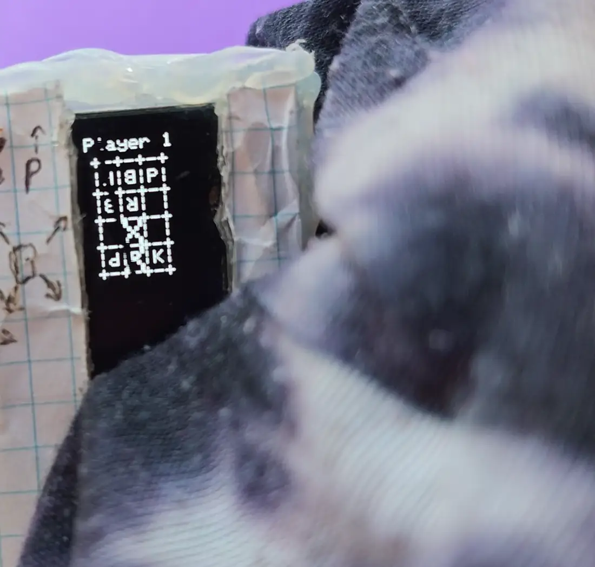 <b>Draw / stalemate</b></td>
    <td align="center"> <b>Victory & scoreboard</b></td>
  </tr>
</table>

### AI & Move Validation
In PvB and BvB modes the bot picks from the set of legal moves. When a King is under threat, the engine only offers King-saving or blocking moves.

<table align="center">
  <tr>
    <td align="center">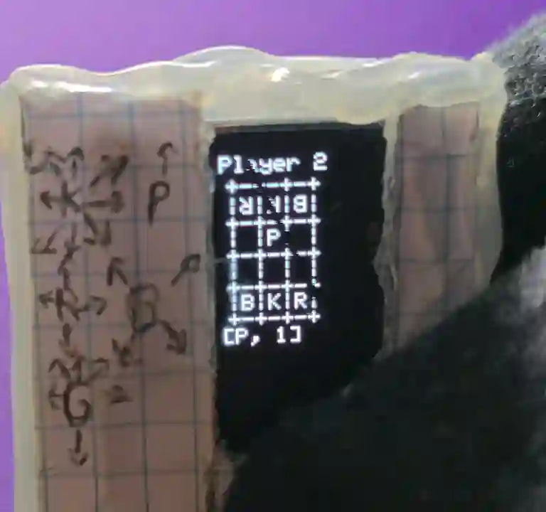 <b>Only King-safe moves under check</b></td>
  </tr>
</table>

## Auto-Save & Resume

The full game state is written to flash (LittleFS) every turn. Unplug or reset the Pico mid-game, power back on, and you can pick up exactly where you left off.

<table align="center">
  <tr>
    <td align="center">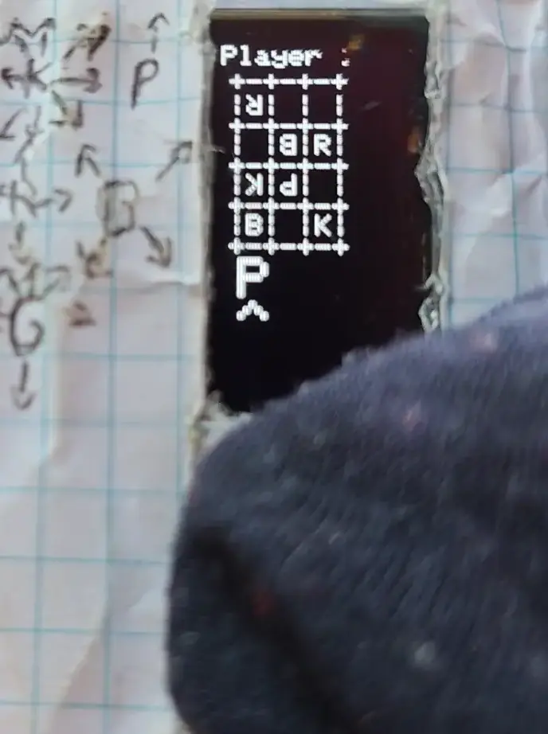 <b>Unplug and resume from saved state</b></td>
  </tr>
</table>

## Installation & Flashing

1.  Install the [Earle F. Philhower RP2040 core](https://github.com/earlephilhower/arduino-pico) in your Arduino IDE.
2.  Open the `.ino` file.
3.  Ensure your board settings allocate flash memory for LittleFS (e.g., "Flash Size: 2MB (Sketch: 1MB, FS: 1MB)").
4.  Connect your Pico while holding `BOOTSEL`, select the appropriate port, and hit Upload.
